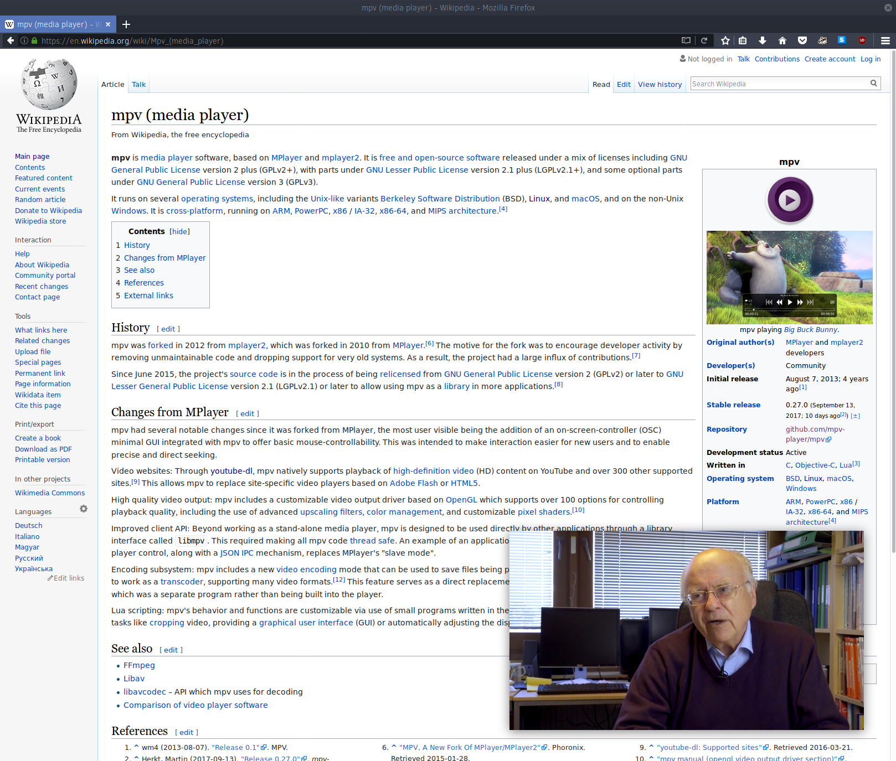

# piptube

Picture-in-picture video wrapper for mpv and youtube-dl

Play local video files and video URLs in a floating, borderless, always-on-top, mpv window.

### Local video files

piptube *video_file.mp4*

### Specific video URL

piptube *youtube_video_url*

### Sequence of YouTube search results

piptube "dogs on skateboards"

### All videos on a channel (starting with most recent)

piptube -c *name_of_youtube_channel*

#### Command line and config file options for

* Position of floating video window

* Size of floating video window

* Video quality

* Number of search results to play

# ytubejb

Use YouTube as a console-based jukebox

Play only the audio of the URL or search result

### Audio from specific URL

ytubejb *youtube_audio_url*

### Sequence of YouTube search results

ytubejb "ambient soundscapes"

#### Command line and config file options for

* Number of search results to play

* Playing audio on repeat

# Availability

Arch Linux [in the AUR](https://aur.archlinux.org/packages/piptube/)
